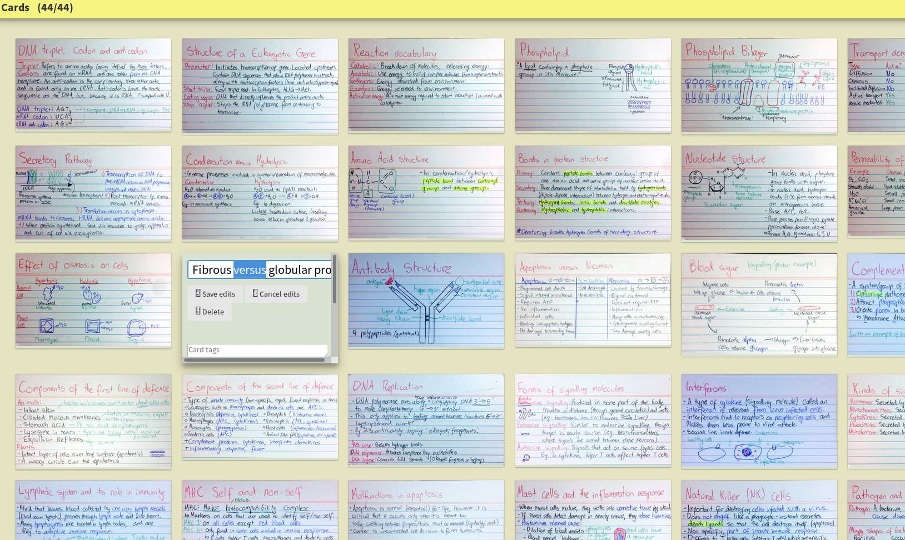
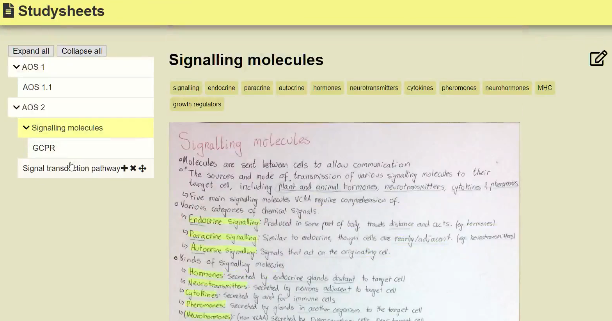
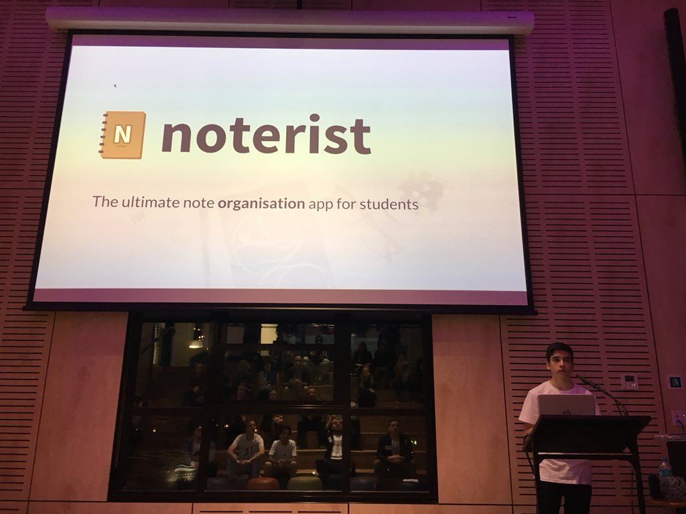

# Noterist
Noterist was a program that I developed in 2018 (Year 11) as a digital store for my biology notes. I liked the flash cards but wanted a way to tag, search and sync them.

Over the six weeks of the BNTS Student Startup program, I improved the website and presented it at a pitch night.

It is no longer live, but it was a great experience launching and presenting a website, and certainly boosted my biology mark!

### Card Page

### Study Sheet Page

## Student Startup Program

https://studentstartup.org.au/case-study-noterist/
